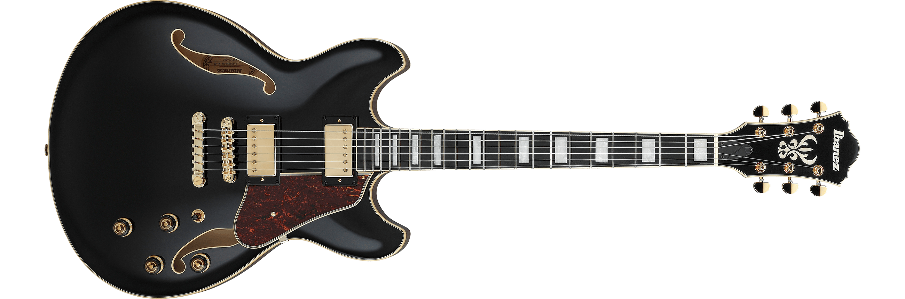

# Midnight Jazz

> Author: [Kihyeon Kwon(Ki)]
>
> **Inspired by**: My Jazz Guitar (Ibanez AS93)

## English

"Hello! This theme is inspired by my Ibanez AS93 jazz guitar! Midnight Jazz is a VS Code color theme that captures the deep black body, brown pickguard, and gold hardware of my guitar. Designed to be simple yet classy, this theme adds a groovy vibe to your coding sessions with a combination of brown and gold highlights. It's optimized for comfortable readability and minimizes eye strain, making long coding sessions more enjoyable!"

---

### Features

1. **Elegant and Simple Color Scheme**
   - **Pure Black**: Background
   - **Brown/Tortoise**: Interface accent elements
   - **Gold/Yellow**: Highlighted text, selection, and key editor token colors
   - Maintains a dark and calm tone while enhancing visibility with gold highlights.
2. **Jazz Instrument Mood**
   - The combination of black, gold, and brown reflects the classic and sophisticated vibe of a jazz guitar.
3. **Enhanced Readability**
   - Clear differentiation between tokens like comments, strings, and keywords to reduce eye strain during long coding sessions.
4. **Recommended Tracks**
   - Pair your coding session with jazz music for an even more enjoyable experience!
   - Exactly Like You - Herb Ellis, Oscar Peterson
   - Midnight Blue - Kenny Burrell
   - Sunny - Pat Martino
   - A Go Go - John Scofield

---

### Installation

1. Open the **Extensions (Ctrl+Shift+X)** panel in Visual Studio Code.
2. Search for `Midnight Jazz` in the search bar.
3. Select this theme from the search results and click the **Install** button.
4. After installation, click the gear icon in the bottom left corner of VS Code → **Color Theme**, and select `Midnight Jazz` from the list.

---

### Usage

1. Ensure that the editor colors display correctly after applying the theme.
2. If needed, adjust UI or token colors via **File → Preferences → Settings** (or `Ctrl+,`).
3. Report any issues or suggestions via the Issues tab.

---

### Color Palette

| Element                | Color          | Hex       |
| ---------------------- | -------------- | --------- |
| **Editor Background**  | Pure Black     | `#000000` |
| **Editor Foreground**  | Soft Gold      | `#d1af60` |
| **String / Literal**   | Brown Tortoise | `#b27945` |
| **Keyword**            | Yellow/Gold    | `#f5d76e` |
| **Comment**            | Muted Brown    | `#7a6850` |
| **Accent / Selection** | Gold Highlight | `#ffcc33` |

> Feel free to customize the colors to your preference!

---

### Screenshots

Screenshot

My guitar

---

### Contributing

- If you encounter any bugs or have suggestions for improvement, feel free to open an issue.
- You can also modify the theme and submit a Pull Request. Contributions are welcome!

---

### License

This theme is licensed under the MIT License. Feel free to use, modify, and redistribute it.

---

### Special Thanks

- My jazz guitar (Ibanez AS93) for the inspiration!
- Hye-Kyung for gifting me this amazing guitar!
- All users enjoying this theme with VS Code.

---

Enjoy the theme and leave feedback if you like it! Enhance your coding productivity with the groove of jazz.
