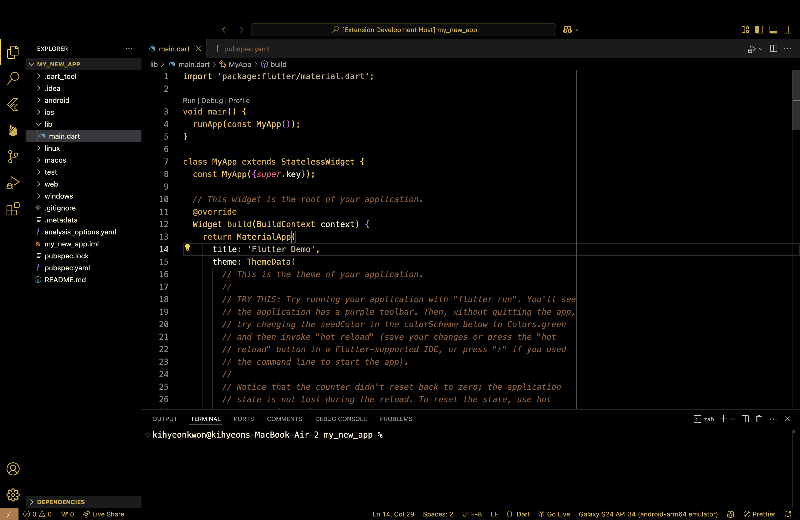

# Ebony Tortoise & Gold

> Author: [Kihyeon Kwon(Ki)]
>
> **Inspired by**: My Jazz Guitar (Ibanez AS93)

“안녕하세요! 이 테마는 제가 사용하는 아이바네즈 as93 기타에서 영감을 받아 만들었습니다! 재즈 기타의 깊은 블랙 바디, 브라운 피크가드, 그리고 골드 하드웨어에서 영감을 얻은 VS Code 컬러 테마입니다. 심플하면서도 클래식한 재즈 느낌과 고급스러운 브라운과 골드 포인트를 살려, 코드 편집에 그루브를 더해주는 테마입니다. 편안한 가독성과 눈의 피로를 최소화하도록 디자인했으니, 코딩 세션을 더욱 즐겁게 보내세요!”

---

## Features

1. **심플하고 고급스러운 색 조합**
   - **Pure Black**: 배경
   - **Brown/Tortoise**: 인터페이스의 포인트 요소
   - **Gold/Yellow**: 선택된 텍스트나 강조 표시, 에디터 토큰 강세 색깔 등
   - 전반적으로 어둡고 차분한 느낌을 유지하면서도 골드 포인트로 시인성을 높였습니다.
2. **재즈 악기 무드**
   - 블랙과 골드/브라운 조합은 재즈 기타 특유의 클래식하고 고급스러운 느낌을 살려줍니다.
3. **편안한 가독성**
   - 주석, 문자열, 키워드 등의 토큰 색을 명확히 구분해, 긴 코딩 세션에서도 눈의 피로를 최소화하도록 디자인했습니다.
4. **추천 곡**
   - 코드 작성 시, 재즈 음악과 함께 듣기 좋은 곡을 추천해드립니다. 코드 작성을 더욱 즐겁게 만들어보세요!
   - Exactly Like You - Herb Ellis, Oscar Peterson
   - Midnight Blue - Kenny Burrell
   - Sunny - Pat Martino
   - A Go Go - John Scofield

---

## Installation

1. **Visual Studio Code**에서 `Extensions (Ctrl+Shift+X)` 패널을 열어주세요.
2. 상단 검색창에 `Midnight Jazz' 을 입력해 검색합니다.
3. 검색 결과에서 본 테마를 선택 후, **Install** 버튼을 클릭합니다.
4. 설치가 완료되면 VS Code 좌측 하단의 톱니바퀴 → **Color Theme**를 클릭한 뒤, 테마 목록에서 `Midnight Jazz`를 선택하세요.

---

## Usage

1. 테마 적용 후 에디터 색상이 정상적으로 표시되는지 확인하세요.
2. 필요하다면, **File → Preferences → Settings** (또는 `Ctrl+,`)에서 UI 색상이나 토큰 색상을 세부 조정할 수도 있습니다.
3. 문제나 개선점이 있으면 언제든 Issue를 등록해주세요!

---

## Color Palette

| Element                | Color          | Hex       |
| ---------------------- | -------------- | --------- |
| **Editor Background**  | Pure Black     | `#000000` |
| **Editor Foreground**  | Soft Gold      | `#d1af60` |
| **String / Literal**   | Brown Tortoise | `#b27945` |
| **Keyword**            | Yellow/Gold    | `#f5d76e` |
| **Comment**            | Muted Brown    | `#7a6850` |
| **Accent / Selection** | Gold Highlight | `#ffcc33` |

> 실제로는 원하는 컬러를 직접 커스터마이징해 사용하세요!

---

## Screenshots

---

## Contributing

- 버그나 개선할 점이 있다면 이슈를 열어 제안해주세요.
- 직접 테마 색상이나 설정을 수정하셔도 좋습니다. Pull Request 역시 환영합니다.

---

## License

이 테마는 MIT 라이선스를 따릅니다. 자유롭게 사용하고, 필요하다면 수정/재배포해도 됩니다.

---

## Special Thanks

- 영감이 되어준 내 재즈 기타 (Ibanez AS93)!
- 기타를 선물해준 사랑하는 희경이!
- VS Code와 함께 테마를 즐겨줄 모든 사용자

---

즐겁게 사용하시고, 피드백을 남겨주시면 감사하겠습니다! 재즈의 감성과 함께 코딩 생산성을 높여보세요.
